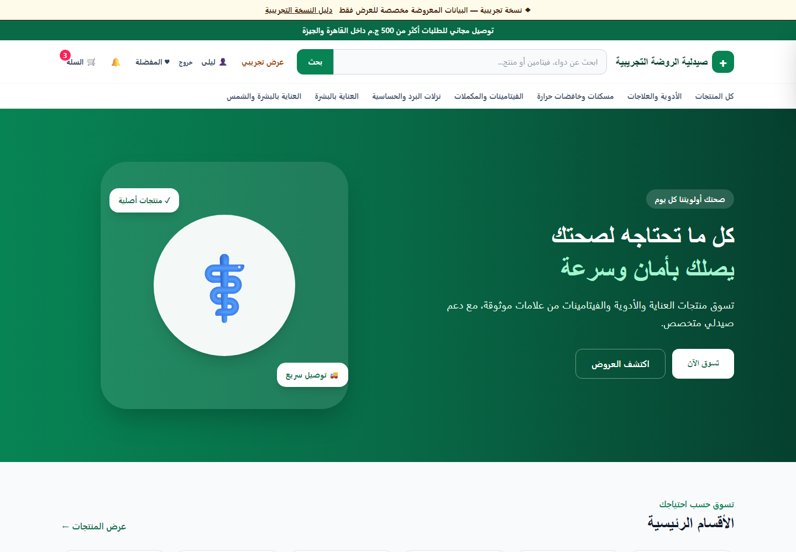
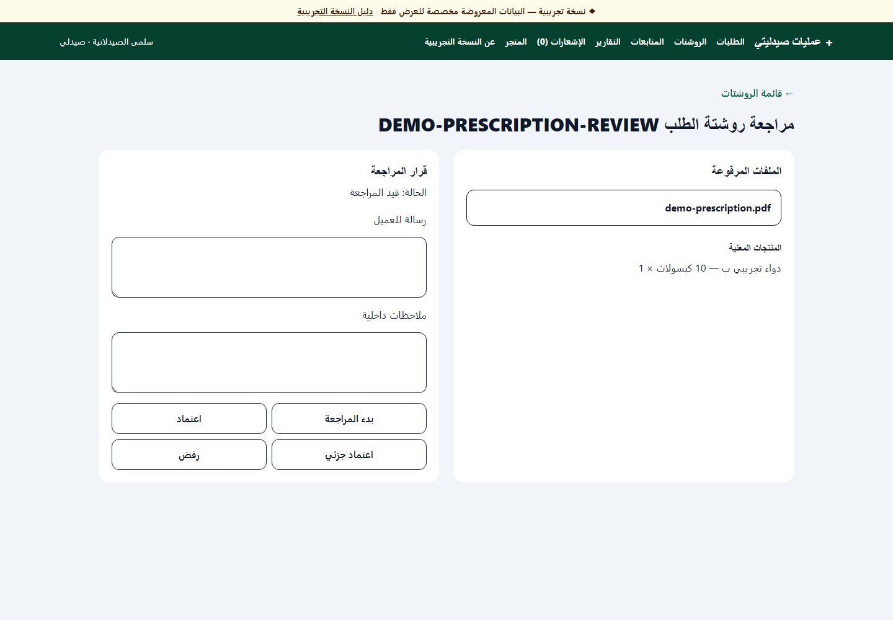
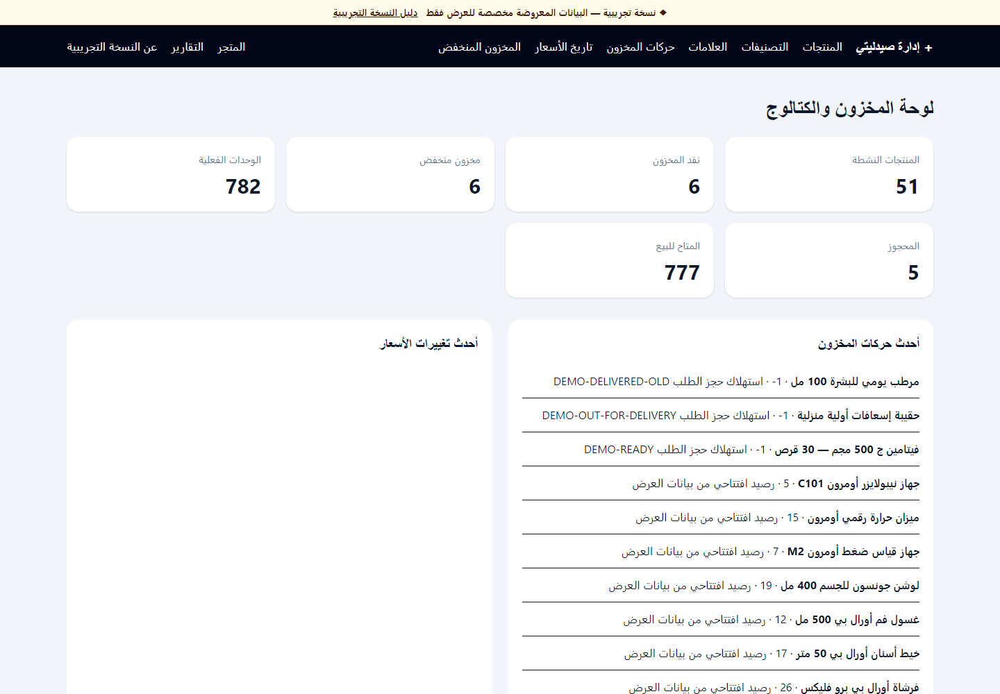
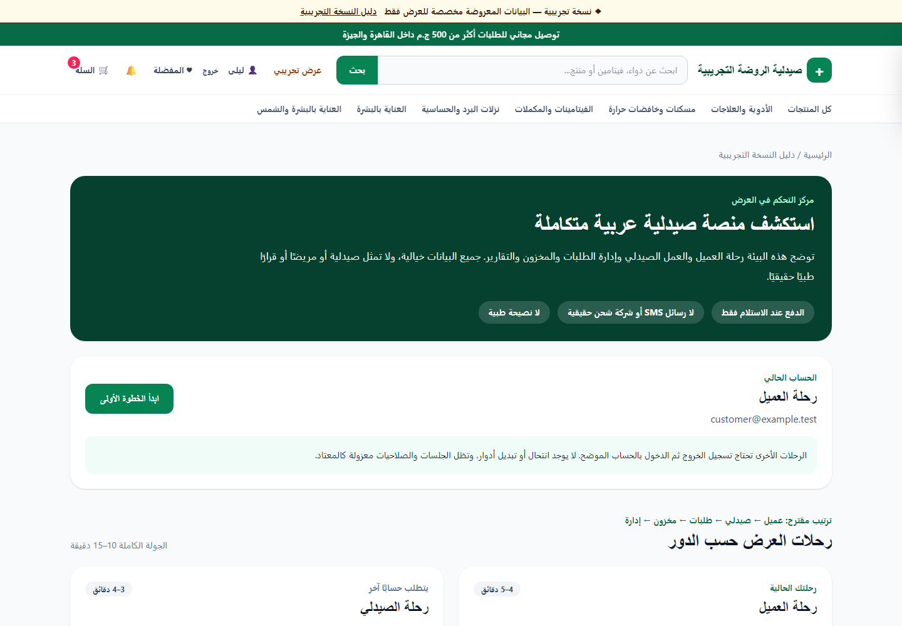

# Engineering case study: an Arabic pharmacy workflow in one Rails application

## Overview

Saydaliyati is a portfolio implementation of an Arabic RTL pharmacy storefront
and its internal operating workflow. It is conceptually intended for a
single-community-pharmacy context: customers discover products and submit
orders, while pharmacists, order staff, inventory staff, and administrators
work from role-specific interfaces over the same commercial record.

The project is demonstrated with deterministic fictional data. It was not built
from a claimed engagement with a real pharmacy client and does not represent a
medical or regulatory certification.

## The problem

The project was designed around a coordination problem rather than a catalog
alone. A pharmacy order can involve:

- an Arabic customer experience and delivery address;
- a product that may require a prescription;
- private document handling and a pharmacist decision;
- stock that must not be promised twice while review is pending;
- order, picking, packing, dispatch, and delivery hand-offs;
- delivery capacity, promotion limits, and historical pricing;
- enough operational history for support, reporting, and investigation.

Treating these as disconnected CRUD screens would make totals, stock, and state
easy to contradict. The design therefore models the customer and staff journey
as one connected workflow with explicit ownership and transition boundaries.

## Product approach

The storefront stays familiar: browse, search, filter, wishlist, cart, coupon,
address, delivery choice, and cash-on-delivery checkout. Complexity appears only
when required. A prescription product asks for bounded documents; the resulting
order waits for a clean scan and pharmacist review while holding stock according
to a longer reservation policy.

Internal interfaces are divided by responsibility. Pharmacists see prescription
material but do not manage inventory costs. Order managers progress orders and
delivery but cannot open prescription files. Inventory managers manage stock and
catalog but not medical content. Administrators oversee users, settings,
promotions, reporting, and security operations.

## Key engineering challenges

### Arabic RTL without a separate frontend

The interface uses server-rendered Rails views, semantic Arabic markup,
direction-aware layouts, Tailwind responsive utilities, and small Stimulus
controllers. Hotwire preserves quick navigation and form updates without
creating a second client-side application or duplicated authorization layer.

*The storefront keeps Arabic discovery, commerce navigation, and promotional
content in a direction-aware server-rendered layout.*

### Role isolation and privileged authentication

Devise supplies the account lifecycle. Capability methods and scoped controller
queries express the role matrix on the server; hiding navigation is only a UI
convenience. Privileged users enroll in TOTP, receive digested single-use
recovery codes, and are bound to a session version that changes after sensitive
identity updates. Cross-role request tests exercise medical, cost, export, and
administrative boundaries.

### Prescription upload safety

The upload path combines extension/MIME/size/count rules with bounded file
signature inspection. Files use private Active Storage configuration and an
authorized application route. A background scanner adapter supports ClamAV;
pending, failed, or infected files remain unavailable for review. This is a
defense boundary, not a claim that scanning works without an operator-configured
real scanner.

*The pharmacist view exposes the state required for a decision without making
the private prescription document part of the portfolio image.*

### Inventory correctness

Checkout does not immediately decrement stock. It locks products and creates
one active reservation per order item. Available-to-sell quantity subtracts
those active reservations. At the ready-for-delivery transition, consumption
locks the relevant records, decrements physical stock, marks reservations
consumed, and writes append-only, arithmetically validated movements.
Cancellation or rejection releases active reservations rather than adding stock
that was never removed.

*Operational visibility reflects the same physical/reserved/available model
enforced by the transaction services.*

### Commercial history and concurrency

Orders snapshot item names, brands, categories, prices, customer details,
addresses, delivery terms, promotions, and totals. Later catalog or setting
changes cannot rewrite history. Transactions, deterministic lock ordering,
optimistic versions, uniqueness constraints, and idempotency keys cover repeated
checkout, transition, movement, export, mail, and scheduled-job behavior.

### A repeatable portfolio demonstration

A useful portfolio application needs coherent states, not random seed rows.
`DemoData::Seeder` creates fictional accounts, stock, movements, prescriptions,
orders, fulfilments, delivery rules, promotions, and dates under stable business
identifiers. It returns a typed manifest, is safe to run twice, suppresses
external job execution while seeding, and refuses unsafe environments.

The guided demo resolves those stable identifiers under the current user's
normal permissions. The project intentionally uses normal password/TOTP login
instead of impersonation or a demo bypass.

*The guide turns deterministic records into reviewable role journeys while
preserving normal authentication and authorization.*

## Notable implementation decisions

### Rails modular monolith

The workflow benefits from local transactions across cart, order, inventory,
promotion, prescription, and fulfilment records. A modular monolith keeps those
consistency boundaries explicit while still separating domains in service and
query namespaces.

### Hotwire over a client SPA

Server rendering keeps Arabic content, validation, authorization, and navigation
in one application. Turbo and Stimulus enhance the experience where they add
value without turning every screen into an API/client pair.

### Service objects for transitions

Multi-record decisions live in focused objects such as
`Orders::CreateFromCart`, `Prescriptions::Review`,
`Inventory::ConsumeReservations`, and `Delivery::UpdateFulfilment`. This makes
authorization, locking, state rules, notifications, and result errors visible
and directly testable.

### State machines expressed as explicit rules

The project does not depend on a state-machine gem. Allowed edges are small,
auditable maps inside transition services, paired with enum validation and tests.
This keeps repeated operations and side effects under application control.

### Stable business identifiers

Public orders use order numbers and products use slugs. Demo scenarios use
stable order numbers, emails, SKUs, zone codes, and promotion references.
Primary keys remain database details and are not embedded in documentation or
journey configuration.

### Central demo mode, no shortcut authentication

`DemoMode.enabled?` is the only environment query exposed to application code.
Its safety policy protects specific actions and accounts, while all normal
authorization and 2FA behavior remains active. Infrastructure isolation is an
operator responsibility; demo mode is not treated as a security boundary by
itself.

## Testing and quality

The Minitest suite includes model, service, query, request/integration, job, and
authorization coverage. High-risk tests exercise concurrent stock, promotion,
slot, and final-admin operations; upload spoofing and scanner failures; TOTP and
session invalidation; export ownership; mail retry; security headers; health
privacy; and deterministic demo behavior.

GitHub Actions runs the test suite against PostgreSQL, RuboCop, Brakeman,
bundler-audit, importmap audit, Zeitwerk, Tailwind and production asset builds.
A separate Docker job builds the multi-stage image, confirms it runs as non-root
without development/test gems, eager-loads production code, and checks `/up`.

Verification counts are intentionally not presented as a permanent product
metric. The current commit and CI run should be consulted for the latest result.

## Engineering outcomes

- One demonstrable flow connects Arabic shopping to order, prescription,
  inventory, fulfilment, delivery, notification, and reporting records.
- Role boundaries allow operational work without granting every employee access
  to medical, financial, or administrative data.
- Reservations and append-only movements provide a coherent explanation of
  physical, reserved, and available stock.
- Historical snapshots keep submitted orders stable after catalog, pricing,
  address, delivery, and promotion changes.
- Deterministic fictional data and role-aware journeys make complex states
  reviewable without real customer or medical information.
- CI, Docker verification, startup validation, health checks, and operational
  runbooks make deployment requirements inspectable without claiming that a
  permanent production environment exists.

No unsupported revenue, conversion, performance, or real-client outcome is
claimed.

## Trade-offs and limitations

- There is no permanent public deployment; remote demos are temporary and
  operator-managed.
- Data is scoped to one global pharmacy, not branches or tenants.
- Cash on delivery is the only operational payment method.
- Supplier purchasing, lots/batches, expiry/FEFO, POS, returns, loyalty,
  substitution, and drug-safety rules are not implemented.
- There is no SMS, courier, payment-gateway, or public API integration.
- Linux browser installation was unavailable in the Phase 15E environment.
  Real-browser journeys and captures were instead run against local Rails using
  installed Chrome through the DevTools protocol. The repository still has no
  committed Selenium system-test suite for these guided journeys.
- Technical safeguards do not replace legal, privacy, pharmacy, security, or
  accessibility review for a real operating market.

## Next steps

The roadmap deliberately grows operational depth after the current commerce
foundation:

1. Suppliers and purchasing.
2. Batch/lot, expiry, and FEFO inventory.
3. Pharmacy POS.
4. Per-item prescription review and substitution.
5. Drug safety rules.
6. Advanced Arabic search.
7. Returns and reverse logistics.
8. Loyalty and wallet.
9. Multi-branch operations.
10. SaaS multi-tenancy.
11. APIs and integrations.
12. Advanced analytics.

See the [feature matrix](feature_matrix.md) for the implemented/planned boundary
and [architecture](architecture.md) for current technical details.
