# Visual gallery

These images were captured from the real Rails application with the deterministic
fictional demo dataset. Desktop captures use 1440 × 1000 CSS pixels and mobile
captures use 390 × 844. Passwords, TOTP values, recovery codes, storage URLs,
and real personal or medical data are not shown.

## Customer experience

**Arabic storefront** — customer role; storefront home. The reviewer should
notice the RTL information hierarchy, Arabic product discovery, and responsive
commerce navigation.

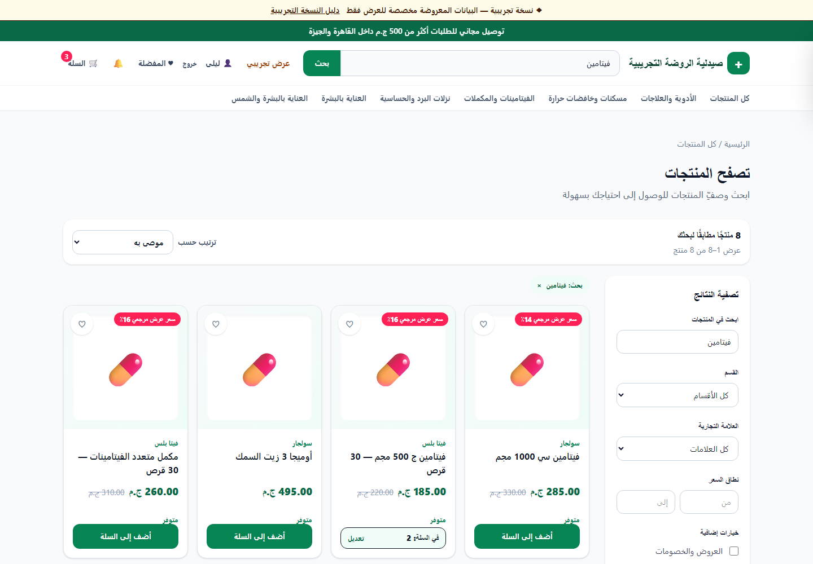

**Catalog search** — customer role; deterministic product search. It demonstrates
search, filtering, availability, and promotion-aware catalog presentation.

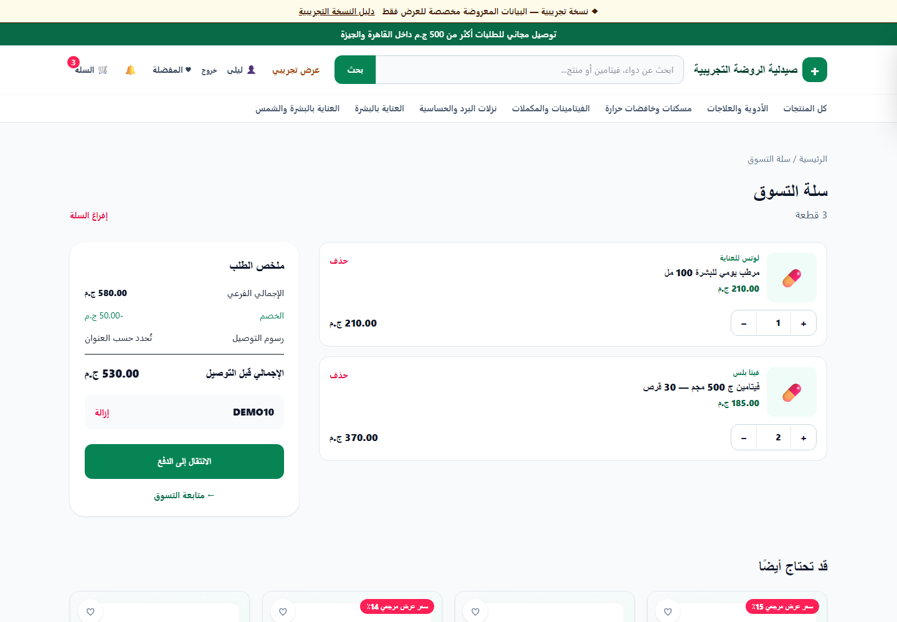

**Cart and coupon** — customer role; active cart with coupon `DEMO10`. Product,
discount, and total calculations remain visible before checkout.

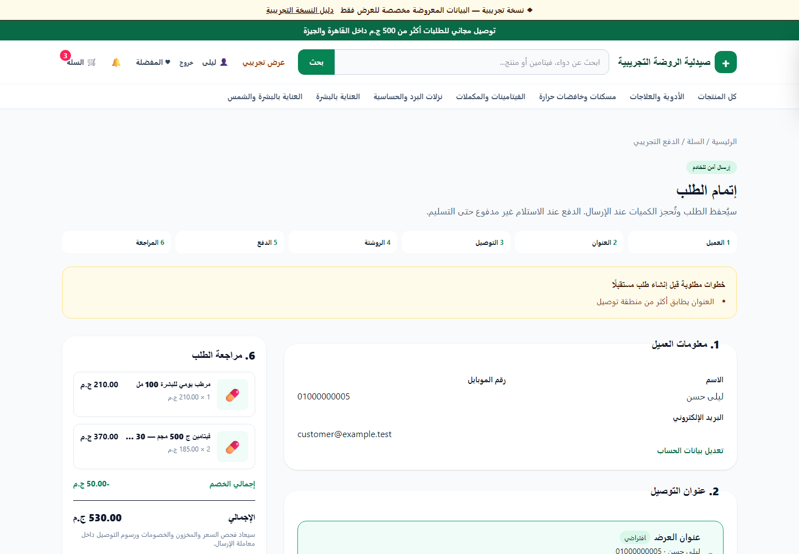

**Checkout and delivery** — customer role; seeded fictional address and delivery
zone. Coverage, fee, and cash-on-delivery policy are validated together.

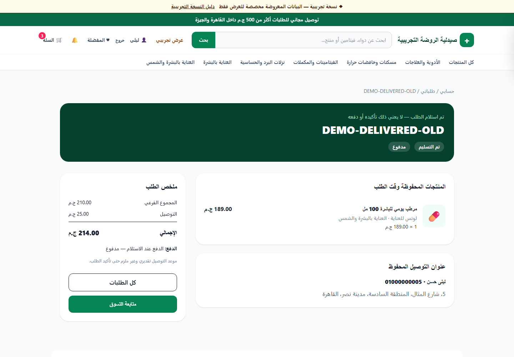

**Delivered order** — customer role; stable order `DEMO-DELIVERED-OLD`. The view
shows historical totals and workflow progress without relying on current catalog
values.

## Prescription workflow

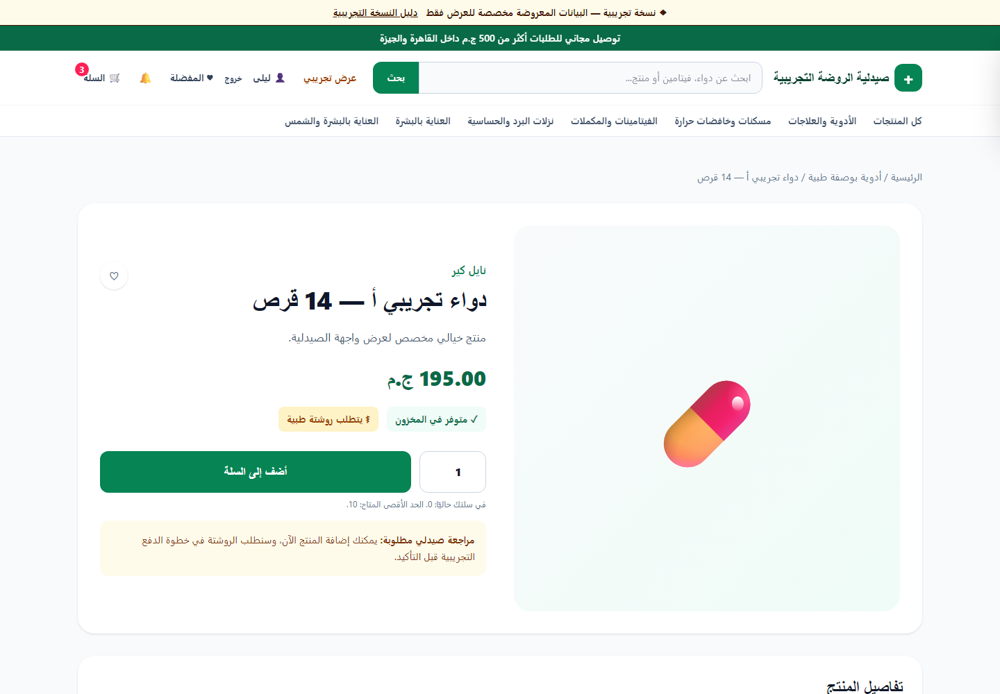

**Prescription entry point** — customer role; SKU `RX-A100`. The product declares
its prescription rule before checkout.

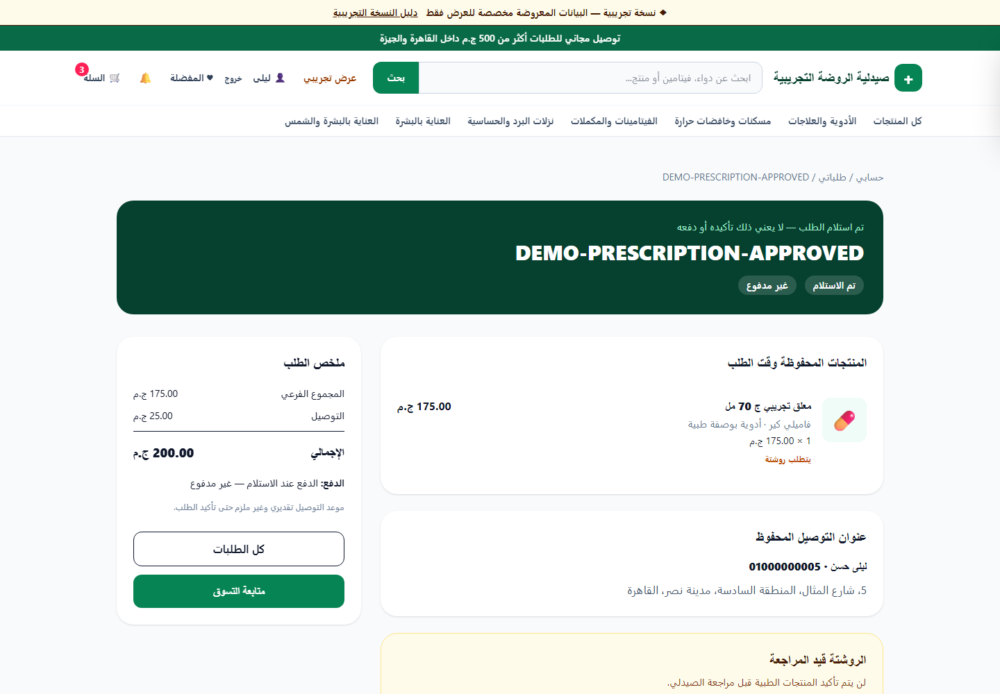

**Customer prescription state** — customer role; seeded prescription order. The
customer sees workflow state while private document content remains outside the
portfolio image.

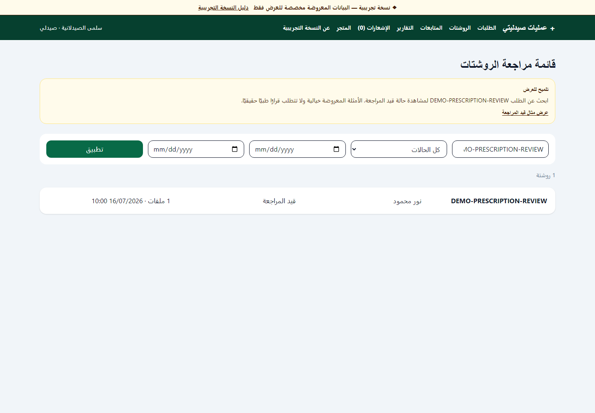

**Pharmacist queue** — pharmacist role; order
`DEMO-PRESCRIPTION-REVIEW`. It shows a focused medical-work queue without
granting general administration access.

**Review detail** — pharmacist role; the same stable order. Explicit scan and
review states gate the decision; no prescription content is reproduced here.

## Fulfilment

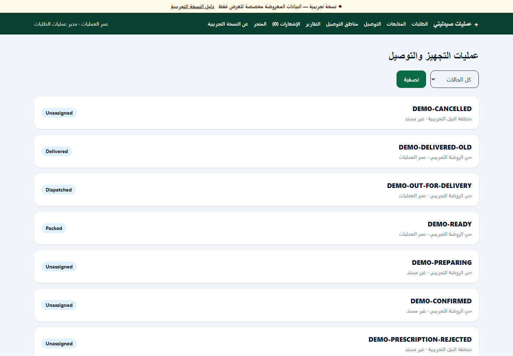

**Fulfilment board** — order-manager role; stable orders including
`DEMO-PREPARING`, `DEMO-READY`, and `DEMO-OUT-FOR-DELIVERY`. The board connects
operational hand-offs to order state.

## Inventory

**Inventory dashboard** — inventory-manager role; deterministic healthy, low,
zero, and reserved stock. The separate quantities make availability auditable.

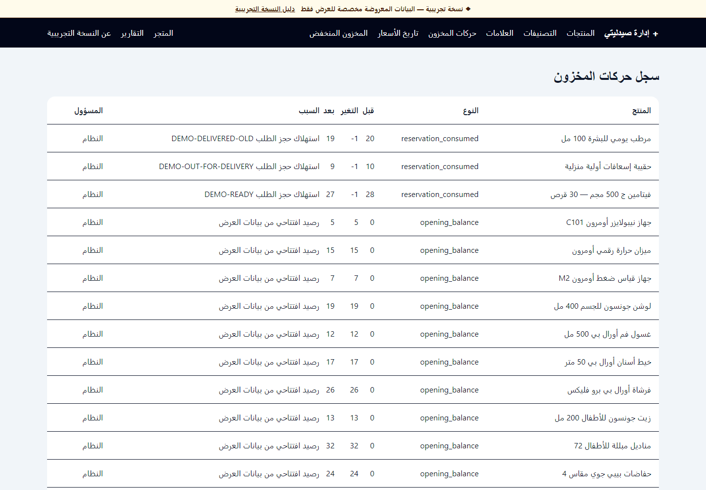

**Movement history** — inventory-manager role; opening balances and order
consumption. Reviewers can trace physical changes to stable business references.

## Administration and reporting

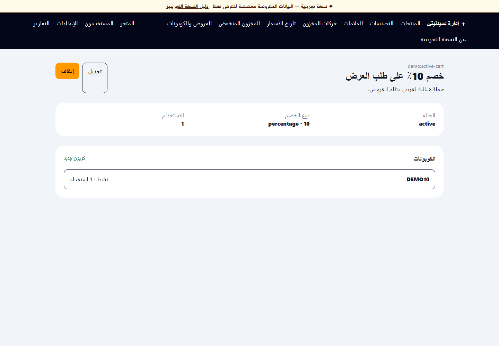

**Promotion and coupon** — administrator role; promotion `demo:active-cart` and
coupon `DEMO10`. Scope, timing, and limits are explicit.

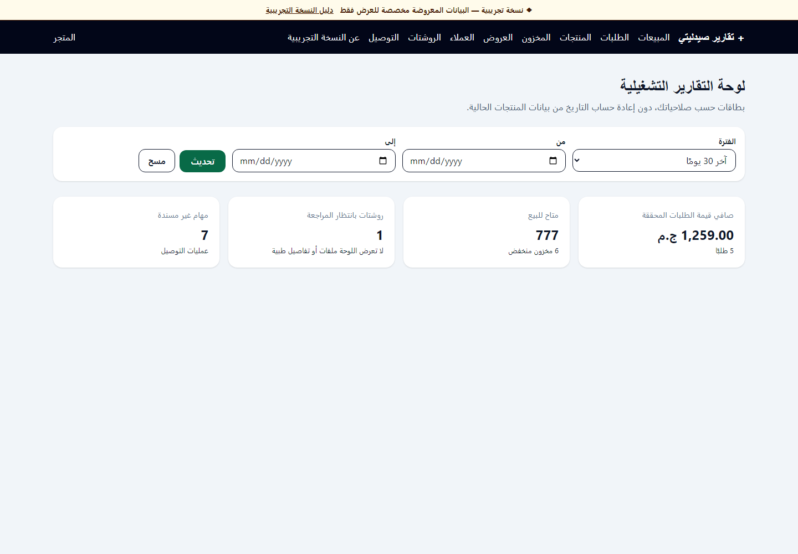

**Reports dashboard** — administrator role; last 30 days. The page connects
commerce totals, available stock, prescription workload, and fulfilment status.

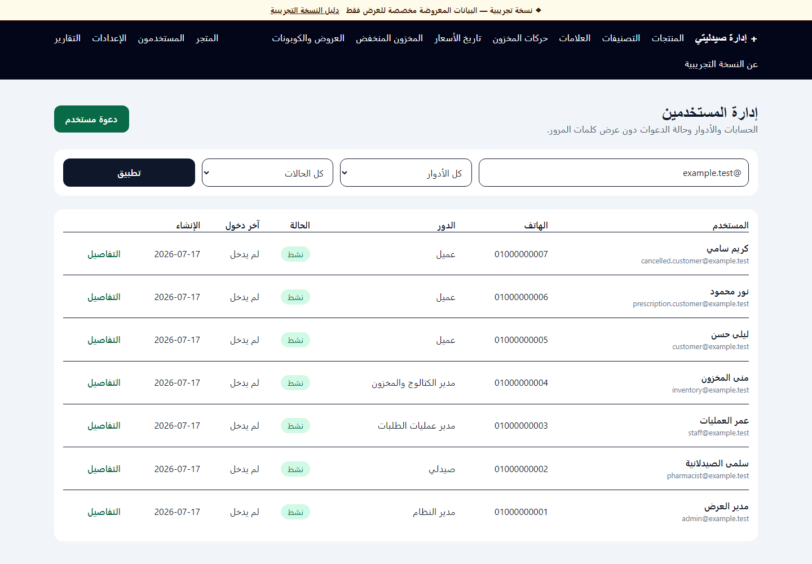

**User administration** — administrator role; fictional `example.test`
accounts. Roles and account states are visible without exposing credentials.

## Guided demo

**Guided demo center** — customer role; `/demo`. Stable scenario links are
resolved under normal authorization, with no impersonation or authentication
bypass.

## Mobile experience

| Storefront | Product catalog |
| --- | --- |
|  |  |

| Cart | Guided demo |
| --- | --- |
|  |  |

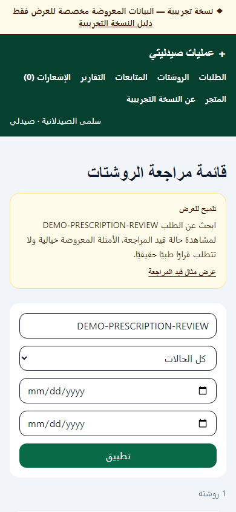

**Mobile staff queue** — pharmacist role; 390-pixel viewport. Filters and the
seeded review row remain usable without horizontal document overflow.

## Practical visual review

The capture pass confirmed RTL document direction, 390-pixel layout without
document-level horizontal overflow, visible headings and labelled controls, and
normal password-plus-TOTP navigation for privileged roles. It was a practical
browser review, not a formal WCAG conformance audit. Dense operational tables
remain best suited to desktop even though their surrounding pages are usable on
a narrow viewport.
